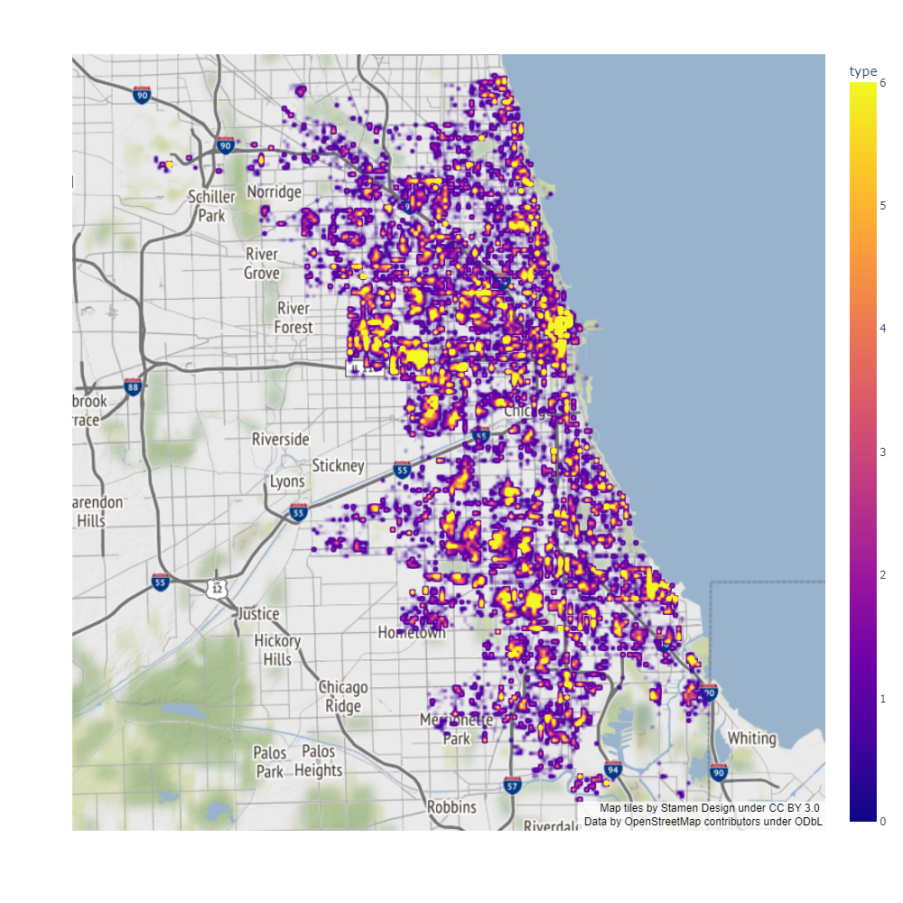
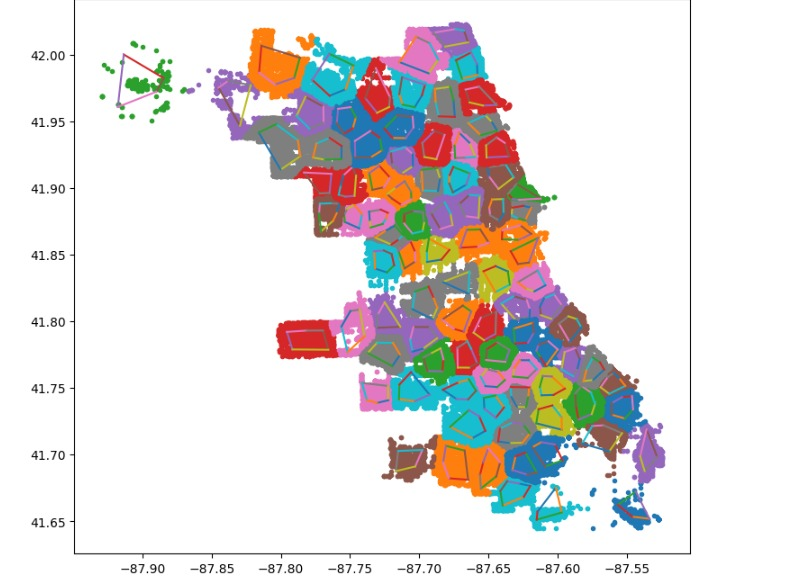

# *nikolaj*

A repository for a Statistical Machine Learning Hackathon conducted at Bennett University during 12-13 November, 2022. Created by Team number 22 as part of the hackathon itself, by members Vasu Jain, Manya Sharma, and Anand Chauhan. The entire project was developed during the hackathon, over the course of 18 hours.

## `IDEA`

The central idea of the project is to attempt to create a useful police patrol plotter using crime data. Of course, the availablility of crime data with location co-ordination proved to be the most limiting factor in the entire project, and we could only find 4 such datasets that were completely usable.

As user input, our program requires the following:

- the city that the plot is for
- the number of precincts
- average number of officers per precinct (NOT IMPLEMENTED YET)
- the timeframe of the shift

Most of this is handled with a friendly user interface. The main hurdle to cross now is the fact that the program is quite slow. Which, could be expected considering the amount of data that needs to be processed every time a new request is received, still needs optimization wherever possible nonetheless. And the fact that we need to find a proof of concept to actually chart the routes themselves that can be implemented. Some example screenshots are attached.

The basic heatmap (over chicago, with a basic timeframe), plotted using plotly.

A prototype plot of the precinct zones.
